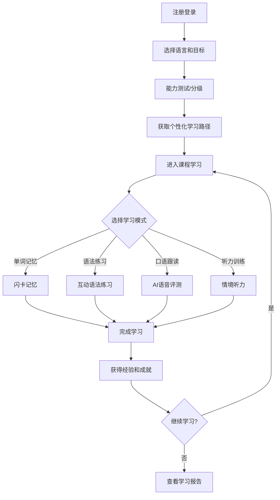
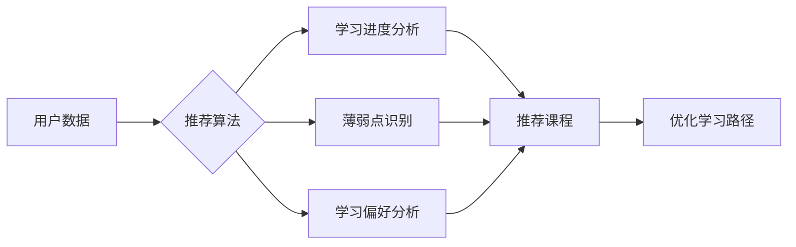

# LinguaWorld - 多语种沉浸式在线教育平台

## 1. 产品概述

LinguaWorld 是一款专注于多语种学习的在线教育平台，支持英语、日语、韩语等主流语言的沉浸式学习体验。平台通过互动式学习模块、个性化学习路径和成就激励系统，帮助用户高效掌握目标语言。

**目标用户**：语言学习爱好者、学生、职场人士、旅行爱好者
**核心价值**：提供趣味性强、效果显著的语言学习体验，让语言学习变得轻松有趣

## 2. 核心功能

### 2.1 用户角色

| 角色 | 注册方式 | 核心权限 |
|------|----------|----------|
| 游客 | 无需注册 | 浏览首页、体验demo课程 |
| 注册用户 | 邮箱/手机号注册 | 完整学习功能、进度追踪、社区交流 |
| VIP用户 | 付费升级 | 高级课程、AI口语陪练、无限制学习 |

### 2.2 功能模块

1. **首页/仪表盘**：学习概览、快速入口、推荐课程、每日任务
2. **课程中心**：分级课程体系、课程详情、学习进度
3. **互动学习**：单词记忆、语法练习、口语跟读、听力训练
4. **个人中心**：学习数据、成就徽章、学习路径
5. **社区**：学习小组、经验分享、问答交流

## 3. 核心流程

### 3.1 用户学习流程

### 3.2 个性化推荐流程

## 4. 页面设计

### 4.1 设计风格

**视觉定位**：现代简约、活力动感、国际化

**配色方案**：
- 主色：深空蓝 `#1a1a2e` - 沉稳专业
- 次色：柔光紫 `#7c3aed` - 活力优雅
- 强调色：晨曦橙 `#f97316` - 温暖激励
- 成功色：翡翠绿 `#10b981` - 积极正向
- 背景色：月光白 `#fafafa` / 暗夜灰 `#0f0f1a`
- 文字色：深墨 `#1f2937` / 浅灰 `#9ca3af`

**字体选择**：
- 标题：Source Han Sans SC (思源黑体) / Poppins
- 正文：Inter / Noto Sans SC
- 代码/音标：JetBrains Mono

**布局风格**：
- 卡片式布局，圆角 16px
- 顶部固定导航，侧边栏可收起
- 响应式设计，支持移动端

**动效风格**：
- 页面切换：滑动渐变 300ms ease-out
- 按钮交互：缩放 0.98 + 阴影变化
- 进度更新：弹性动画 + 数字滚动
- 成就解锁：粒子爆炸 + 闪光效果

### 4.2 页面详情

#### 首页/仪表盘
| 模块 | UI元素 | 交互描述 |
|------|--------|----------|
| 顶部导航 | Logo、语言切换器、搜索框、用户头像 | 点击头像展开下拉菜单 |
| 学习卡片 | 语言图标、进度环、继续学习按钮 | 点击进入对应课程 |
| 今日任务 | 任务列表、勾选状态、奖励积分 | 点击完成任务获得经验 |
| 推荐课程 | 轮播卡片、分类标签、难度星级 | 左右滑动浏览 |
| 学习数据 | 连续天数、已学单词、本周学习时长 | 数据卡片动画展示 |

#### 课程中心
| 模块 | UI元素 | 交互描述 |
|------|--------|----------|
| 语言选择器 | 标签页切换（英语/日语/韩语） | 点击切换语言 |
| 课程分类 | 初级/中级/高级/商务 | 横向滚动标签 |
| 课程卡片 | 封面图、标题、进度条、开始按钮 | 点击进入课程详情 |

#### 互动学习模块
| 模块 | UI元素 | 交互描述 |
|------|--------|----------|
| 单词记忆-闪卡 | 单词卡片翻转、发音按钮、掌握程度 | 点击翻转查看释义 |
| 语法练习-题目 | 选择题/填空题、即时反馈动画 | 选择后显示对错 |
| 口语跟读 | 波形动画、录音按钮、评分星级 | 录音后AI评分 |
| 听力训练 | 音频播放器、字幕切换、倍速控制 | 可调节播放速度 |

#### 个人中心
| 模块 | UI元素 | 交互描述 |
|------|--------|----------|
| 用户资料 | 头像、昵称、等级、积分 | 点击编辑资料 |
| 成就墙 | 徽章网格、已解锁/未解锁状态 | 点击查看成就详情 |
| 学习报告 | 周报/月报图表、学习曲线 | 图表动画展示 |
| 学习路径 | 路线图样式、当前位置标记 | 点击跳转对应课程 |

#### 社区页面
| 模块 | UI元素 | 交互描述 |
|------|--------|----------|
| 动态流 | 卡片列表、点赞评论、学习打卡 | 点击进入详情 |
| 学习小组 | 小组卡片、成员头像、话题标签 | 点击加入小组 |
| 问答区 | 问题卡片、采纳标记、悬赏积分 | 提问/回答互动 |

### 4.3 响应式设计

- **桌面端 (≥1280px)**：三栏布局，侧边栏固定
- **平板端 (768-1279px)**：双栏布局，侧边栏收起
- **移动端 (<768px)**：单栏布局，底部导航栏

## 5. 技术实现要点

### 5.1 前端技术
- React 18 + TypeScript
- Tailwind CSS 3
- Zustand 状态管理
- Framer Motion 动画
- React Router 路由

### 5.2 核心组件
- 语言选择器
- 课程卡片
- 学习进度环
- 闪卡组件
- 音频播放器
- 成就徽章组件

### 5.3 状态管理
- 用户信息、认证状态
- 学习进度、课程数据
- 成就解锁状态
- 社区动态数据
