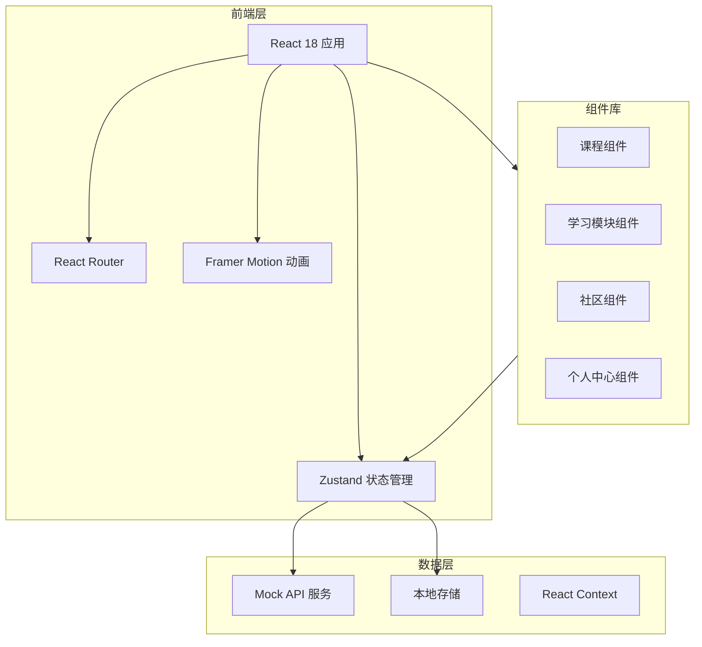

# LinguaWorld 技术架构文档

## 1. 架构设计



## 2. 技术选型

| 技术 | 版本 | 用途 |
|------|------|------|
| React | 18.x | UI框架 |
| TypeScript | 5.x | 类型安全 |
| Vite | 5.x | 构建工具 |
| Tailwind CSS | 3.x | 样式框架 |
| Zustand | 4.x | 状态管理 |
| Framer Motion | 11.x | 动画库 |
| React Router | 6.x | 路由管理 |
| Lucide React | 最新 | 图标库 |

## 3. 路由定义

| 路由 | 页面 | 描述 |
|------|------|------|
| `/` | 首页/仪表盘 | 学习概览、快速入口 |
| `/courses` | 课程中心 | 浏览和选择课程 |
| `/courses/:id` | 课程详情 | 课程内容和进度 |
| `/learn/:type` | 互动学习 | 单词/语法/口语/听力 |
| `/community` | 社区 | 动态、小组、问答 |
| `/profile` | 个人中心 | 用户资料和成就 |
| `/achievements` | 成就中心 | 成就墙和徽章 |
| `/login` | 登录页 | 用户登录 |
| `/register` | 注册页 | 用户注册 |

## 4. 数据模型

### 4.1 用户模型

```typescript
interface User {
  id: string;
  email: string;
  nickname: string;
  avatar: string;
  level: number;
  exp: number;
  joinDate: string;
  nativeLanguage: string;
  learningLanguages: string[];
  streak: number;
  totalWordsLearned: number;
  totalMinutesLearned: number;
}
```

### 4.2 课程模型

```typescript
interface Course {
  id: string;
  language: 'en' | 'ja' | 'ko';
  title: string;
  titleCn: string;
  level: 'beginner' | 'intermediate' | 'advanced';
  description: string;
  coverImage: string;
  totalLessons: number;
  completedLessons: number;
  duration: number;
  lessons: Lesson[];
}

interface Lesson {
  id: string;
  title: string;
  type: 'vocabulary' | 'grammar' | 'speaking' | 'listening';
  content: LessonContent;
  completed: boolean;
}
```

### 4.3 成就模型

```typescript
interface Achievement {
  id: string;
  title: string;
  description: string;
  icon: string;
  category: 'streak' | 'vocabulary' | 'listening' | 'speaking' | 'social';
  requirement: number;
  reward: number;
  unlocked: boolean;
  unlockedAt?: string;
}
```

### 4.4 社区模型

```typescript
interface Post {
  id: string;
  authorId: string;
  authorName: string;
  authorAvatar: string;
  content: string;
  images?: string[];
  likes: number;
  comments: Comment[];
  language: string;
  tags: string[];
  createdAt: string;
}

interface Comment {
  id: string;
  authorId: string;
  authorName: string;
  content: string;
  createdAt: string;
}
```

## 5. 状态管理结构

```typescript
interface AppStore {
  // 用户状态
  user: User | null;
  isAuthenticated: boolean;

  // 学习状态
  currentCourse: Course | null;
  currentLesson: Lesson | null;
  learningProgress: Record<string, number>;

  // 成就状态
  achievements: Achievement[];

  // 社区状态
  posts: Post[];
  currentLanguage: string;

  // Actions
  login: (email: string, password: string) => void;
  logout: () => void;
  updateProgress: (courseId: string, lessonId: string) => void;
  unlockAchievement: (achievementId: string) => void;
  addPost: (post: Omit<Post, 'id' | 'createdAt'>) => void;
}
```

## 6. 组件结构

```
src/
├── components/
│   ├── layout/
│   │   ├── Header.tsx
│   │   ├── Sidebar.tsx
│   │   └── BottomNav.tsx
│   ├── common/
│   │   ├── Button.tsx
│   │   ├── Card.tsx
│   │   ├── ProgressRing.tsx
│   │   └── Badge.tsx
│   ├── course/
│   │   ├── CourseCard.tsx
│   │   ├── CourseList.tsx
│   │   └── LessonItem.tsx
│   ├── learning/
│   │   ├── FlashCard.tsx
│   │   ├── GrammarExercise.tsx
│   │   ├── SpeakingPractice.tsx
│   │   └── ListeningExercise.tsx
│   ├── achievement/
│   │   ├── AchievementCard.tsx
│   │   └── AchievementWall.tsx
│   └── community/
│       ├── PostCard.tsx
│       ├── CommentSection.tsx
│       └── GroupCard.tsx
├── pages/
│   ├── Home.tsx
│   ├── Courses.tsx
│   ├── CourseDetail.tsx
│   ├── Learning.tsx
│   ├── Community.tsx
│   ├── Profile.tsx
│   ├── Achievements.tsx
│   ├── Login.tsx
│   └── Register.tsx
├── stores/
│   └── useStore.ts
├── hooks/
│   └── useAudio.ts
├── data/
│   ├── courses.ts
│   ├── achievements.ts
│   └── mockPosts.ts
├── types/
│   └── index.ts
└── App.tsx
```

## 7. 目录结构

```
/workspace/
├── .trae/
│   └── documents/
│       ├── prd.md
│       └── technical-architecture.md
├── src/
│   ├── assets/
│   ├── components/
│   ├── pages/
│   ├── stores/
│   ├── data/
│   ├── types/
│   ├── App.tsx
│   ├── main.tsx
│   └── index.css
├── public/
├── package.json
├── tsconfig.json
├── tailwind.config.js
├── vite.config.ts
└── index.html
```
